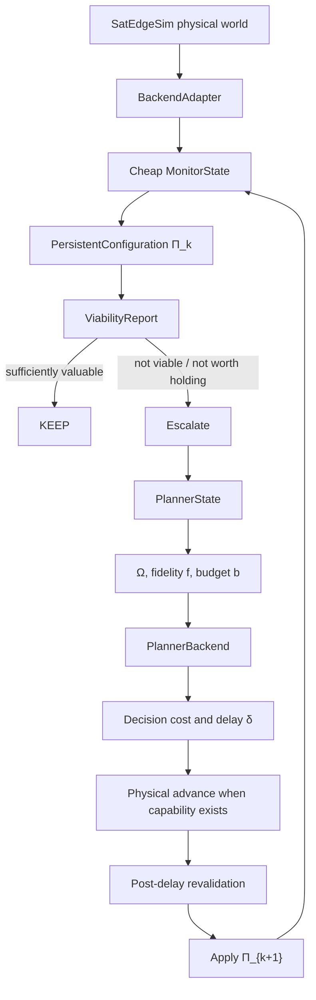

# Endogenous Replanning Architecture

This document maps the paper-level control abstraction to the code added under
`trisatflow.control`. It is an implementation map, not a marketing description.

## Existing architecture before this refactor

The repository's formal and legacy paths are slotwise: `GeoLeoGroundEnv.step`
receives an upper discrete offloading action plus a lower continuous resource
action, evolves the local analytic/trace environment, and returns the next
observation. The hierarchical trainer and the existing MAPPO/MADDPG agents
operate inside that loop. `trisatflow.satedgesim_eval.client.SatEdgeSimClient`
already provides the low-level REST calls used by replay/trace scripts.

The refactor does not delete or change that inner action space. It adds an outer
decision plane which decides whether and when the inner planner should run.

## Code mapping

| Paper concept | Code object | Role |
|---|---|---|
| Persistent execution configuration Π_k | `control.PersistentConfiguration` | Versioned assignments/resources/routes that remain active across physical slots |
| Three clocks | `control.ClockState` | Physical time/slot, monitor epoch, intervention epoch |
| Cheap monitor | `control.MonitorState`, backend `get_monitor_state` | Queue/workload/deadline/load summaries and cached/predictable contact only |
| Heavy escalation state | `control.PlannerState`, backend `get_planner_state` | Candidate VMs, detailed resources, graph and planner observation |
| Robust viability + soft performance risk | `control.ViabilityCertificate`, `SoftPerformanceRisk`, `ViabilityReport` | Unit-aware conservative certificate is separate from optional performance trigger |
| Generic selective subset Ω | `control.ReconfigurationScope`, `ViolationProvenance`, `ScopeGenerator` | Provenance-driven task/source/node/link/route/resource sets; empty Ω is KEEP |
| Planner adapter | `planners.PlannerBackend` | Common interface for greedy and hierarchical MARL backends |
| Fidelity f and budget b | `PlannerFidelity`, `PlanningBudget`, `PlannerSpec` | Candidate limits change acquisition/compute passed to the backend |
| Decision resource accounting | `DecisionCostBreakdown` | Estimated and realized reconfiguration costs remain distinct from C_obs/C_sync/C_solve/C_signal |
| Delay contract | `DecisionDelayBreakdown`, `DecisionDelayModel` | Separates wall-clock measurement from simulated physical delay |
| Value of computation | `PlannerCandidate`, `VoC`, `PlannerArbitrator` | Can reject an expensive high-fidelity candidate |
| Post-delay validity | `PostDelayRevalidator` | Reject/fallback on stale target/contact/deadline/resource bindings |
| Variable-duration transition | `SMDPTransition` | Stores S_k, u_k, reward/cost, S_{k+1}, Δ_k |

## Data flow



The KEEP path calls `get_monitor_state` only. Planner state and planner
backends are acquired after escalation. If an old REST server forces a task
dispatch, `dispatch_under_configuration` is recorded separately from
`num_replans` and `num_configuration_changes`.

## Contributions and implementation boundaries

### Contribution 1: persistent configuration and endogenous timing

`PersistentConfiguration` is not an alias for the previous action. It owns a
stable `config_id`/`version`, creation/application/validation times, bindings,
coverage, planner provenance, and expected horizon. `EndogenousReplanningController`
evaluates it on monitor epochs and only creates a new version after an
intervention. Configuration lifetime is therefore measured as
`tau_(k+1) - tau_k`, not copied from a fixed planner period.

### Contribution 2: viability and selective Ω

`ConservativeViabilityEstimator` emits a `ViabilityCertificate` from unit-aware
lower bounds (MI for service, seconds for deadline/contact) and mandatory
evidence. Missing evidence is not replaced by a favorable value. A separate
`SoftPerformanceRisk` retains degradation/load/trend/uncertainty/volatility
signals and can be disabled explicitly. Neither layer consumes future
stochastic task arrivals, queue realizations, channel realizations or reward.
`ScopeGenerator` builds subsets from `ViolationProvenance` and typed dependency
metadata, preserving the reason each entity entered the candidate.
The reporting buckets `small`, `medium` and `global` are derived from subset
volume only; they are not the theoretical action definition.

`EndogenousReplanningController` keeps observation scope and modification scope
explicit. `_project_configuration` freezes entries outside Ω, and the planner
delta is checked before application so an out-of-scope change cannot be
silently widened. SatEdgeSim publication execution uses the versioned
`/configuration/patch` executor; non-authoritative legacy apply is explicitly
labelled compatibility-only.

### Contribution 3: resource-aware planner arbitration

`PlannerBackend` has cost estimation and planning methods. `GreedyPlanner` is a
lightweight deterministic backend. `HierarchicalMARLPlannerAdapter` is the
high-fidelity adapter for a configured existing `HierarchicalTrainer` or
checkpoint-backed action provider. It does not invent a trained checkpoint.
`PlannerFidelity` changes the backend/resource tier and `PlanningBudget` is
passed into candidate selection, observation restriction and planner calls.
`DecisionCostBreakdown` keeps raw quantities and scalar prices separate from
data-plane reward. `VoC` subtracts intervention cost from estimated improvement
and may select KEEP when a high-fidelity candidate is too expensive.

## Legacy algorithm role

Existing `MAPPO`, `IPPO`, `IQL`, `VDN`, `QMIX`, `MADDPG`, `IDDPG`, `MASAC` and
`ISAC` remain in their original modules and registries. The existing
hierarchical MAPPO + MADDPG combination is now represented by
`HierarchicalMARLPlannerAdapter` when a configured trainer/action provider is
supplied.

Therefore:

```text
existing MAPPO/MADDPG = inner PlannerBackend
existing MAPPO/MADDPG != proposed outer controller
```

The outer controller does not add KEEP to the legacy four-action upper head.
The inner planner still decides target/offloading and CPU/bandwidth/power (and
routes where supported); the outer layer decides WHEN/Ω/f/b.

## Real implementation versus contract/fallback

Implemented in this repository:

- versioned persistent configuration and cross-slot lifetime bookkeeping;
- cheap/heavy state type separation;
- deterministic conservative viability and endogenous trigger;
- generic scope generation and outside-Ω projection;
- planner protocol, greedy backend, hierarchical MARL adapter;
- fidelity/budget propagation, separate cost components, VoC arbitration;
- explicit delay capability and stale-plan revalidation;
- SMDP transition and decision-plane metrics;
- legacy adapter, unit tests and fake-backend smoke.

Compatibility/contract boundaries:

- `LegacyEnvBackendAdapter` is non-authoritative and is only for tests,
  preflight and legacy experiments.
- The SatEdgeSim adapter wraps the existing REST client and uses explicit
  `compatibility_preflight` metadata when it must read `/get_state` as a
  fallback. It never labels that call as a true cheap monitor.
- Physical planning delay is enforced only when the backend advertises both
  physical-delay/advance capabilities. Python wall-clock sleep is never used
  as a substitute.

## Second-phase control-plane semantics

The proposed execution path now separates viability screening from planner
arbitration. `select_scope_planner_budget` first creates causal
`PlanningDescriptor` objects from the cheap monitor and capability metadata;
it does not acquire `PlannerState`. Full planner state is acquired only after
a positive VoC, and scope/budget restrictions are requested only when both the
planner and physical backend advertise the corresponding capabilities.
Otherwise the state acquisition is explicitly marked
`full_state_acquisition_compatibility`.

`ConservativeAnalyticalBenefitEstimator` evaluates every candidate over a
common absolute horizon `[t, t+H]`: the old configuration remains active during
decision delay `δ`, and the candidate is evaluated over `[t+δ, t+H]`. It uses
current summaries, lower-bound service-rate information, cached contact
information and planner descriptors only. It never reads future stochastic
queues, arrivals, channels, remote load or offline oracle labels. The proposed
path has no fidelity benefit multiplier; the old heuristic is available only
through the explicit `heuristic_fidelity_multiplier` ablation.

`DecisionCostBreakdown` keeps raw bytes, seconds, energy proxies, compute
proxies, changed bindings and migration volume separate from their prices.
`PersistentConfiguration.change_counts` and the backend apply receipt populate
realized reconfiguration accounting. Scope volume is reported separately and
is never silently reused as realized migration volume. Wall-clock solver time
is separate from simulated physical delay, and physical delay is considered
enforced only after a verifiable backend time advance or receipt.

## Ablation plumbing

`ControllerConfig.ablations` changes components of the same controller:
fixed-period timing, state-change trigger, global-only/fixed scope, no decision
cost, solver-latency-only/reward-penalty delay, no contact predictability and no
uncertainty margin. No duplicate controller implementation is required.
